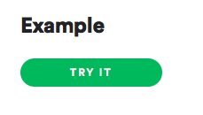
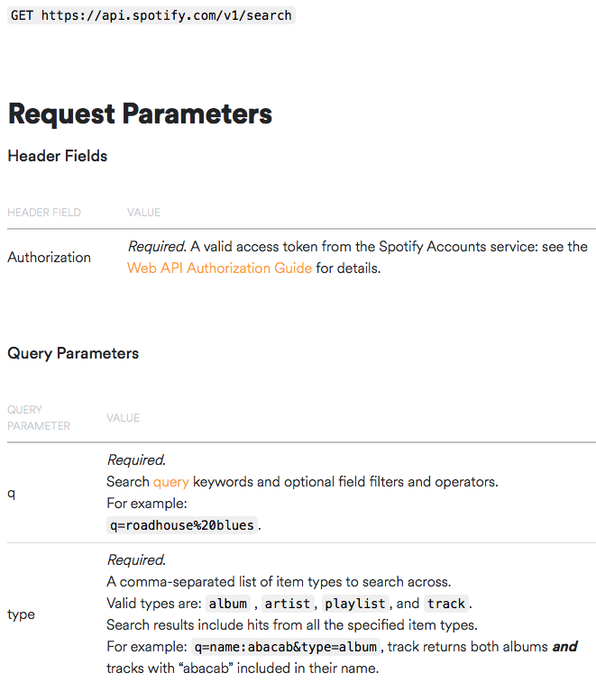

## Objetivo

1. Aprender a utilizar algunas funciones de las siguientes librerias
    i) `httr`
    ii) `jsonlite`
    iii) `purrr`
2. Hacer un **POST** y un **GET** request a un api.
3. Conectarse al API de spotify
4. Manejar listas


## Spotify api


Spotify es un servicio de música, podcasts y vídeos digitales en streaming que te da acceso a millones de canciones y otros contenidos de artistas de todo el mundo.

### Crear una cuenta 

Ingresar a https://developer.spotify.com/ si o se tiene cuenta crear una.

### Crear una nueva app

#### Step 0


#### Step 1


#### Step 2


#### App ready


#### Get Client ID and Client Secret


## Obtener data del api

https://developer.spotify.com/documentation/web-api/reference/


La clave esta en poder tener un codigo de autenticacion, sin este codigo no podemos hace nuestras consultas al api.
Para probarlos hagamos click en el siguietne boton



Nos lleva a esta pantalla


Clicks en ese boton y nos genera nuestro token de autorizacion.


Para armar el request usaremos el programa PostMan


Ejercicio: Armemos un request con postman para hacer un search.


paso 1: https://developer.spotify.com/documentation/web-api/reference/search/search/
paso 2: Hacemos el llamado desde postman


So far, so god. Ahora como lo hacemos programaticamente.


## Calling spotify api from R

### Getting the token

Necesitaremos cargar las siguientes librerias
```{r}
library(httr)
library(curl)
library(jsonlite)
library(purrr)
```


Antes vamos a crear variables de entorno para nuestro `cliente_id` y `client_secret` es buena practica no dejar en el codigo usuraios y contraseñas.

```{r,eval=FALSE}
Sys.setenv(CLIENT_ID="123abc",
           CLIENT_SECRET = "123abc")
```

Revisemos la documentacion, 
https://developer.spotify.com/documentation/general/guides/authorization-guide/


Nuestro primer paso es armar el string que requiere `Authorization` tiene que tenes la siguiente forma `Basic client_id:client_secret` luego codificamos el string en base64, en el codigo se muestra paso a paso.

```{r}
client_id = Sys.getenv("CLIENT_ID")
client_secret = Sys.getenv("CLIENT_SECRET")
auth_str <- paste(client_id,client_secret,sep=':')
id_secret <- RCurl::base64(auth_str)[[1]]
```

Agreguemos esto a los headers de nuestro request,

```{r}
my_headers <- httr::add_headers(c(Authorization=paste('Basic', id_secret,sep=' ')))
```

Ahora formamos el body del `POST`

```{r}
my_body <- list(grant_type='client_credentials')
```

Ya esta todo listo para mandar nuestro request,


```{r}
request <- httr::POST('https://accounts.spotify.com/api/token', my_headers,body=my_body,encode='form')
my_token <- httr::content(request)
str(my_token)
```

Como podemos ver tenemos una lista, en donde el primer elemento es el access_token.


### Lest search for an artist

Ahora estamos lista para buscar la informacion de un artista, revisemos la documentacion para esta endpoint.
https://developer.spotify.com/documentation/web-api/reference/search/search/




```{r}
auth_header <- httr::add_headers('Authorization'= paste('Bearer',my_token$access_token))
url <- "https://api.spotify.com/v1/search"
artist <- URLencode("Metallica")
request <- httr::GET(paste(url,'?q=',artist,'&type=artist',sep=''),auth_header)
artist_info <- httr::content(request)
str(artist_info)
```


